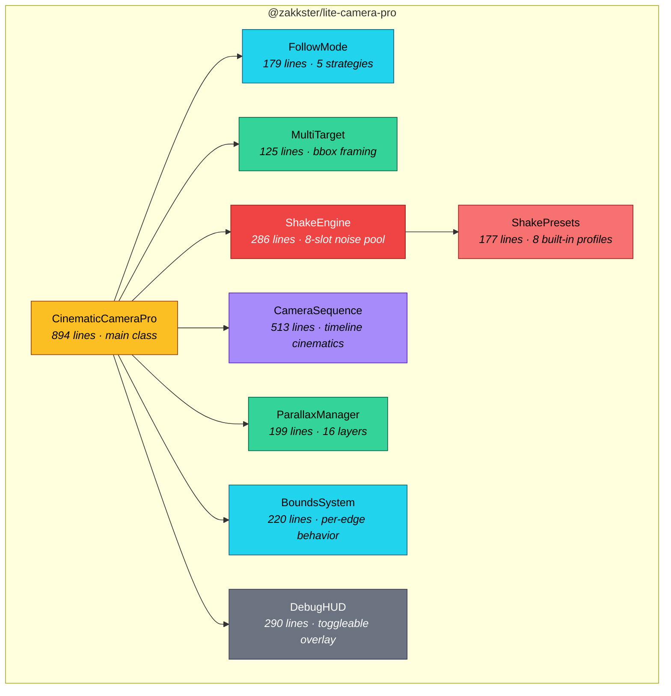
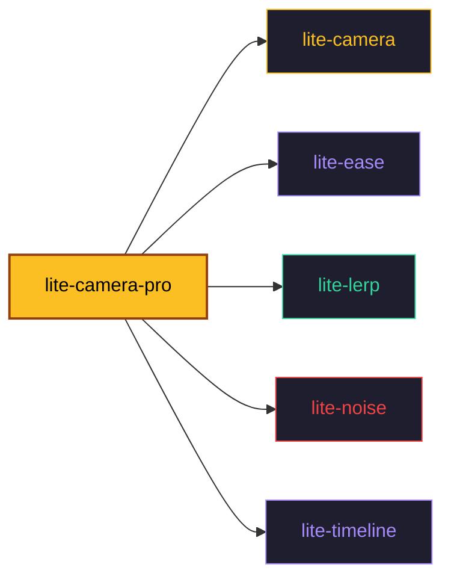
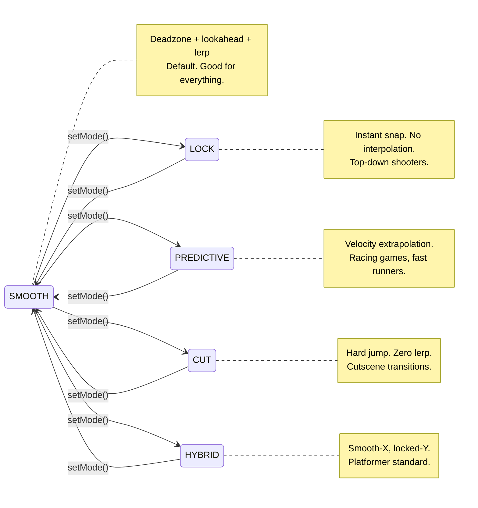
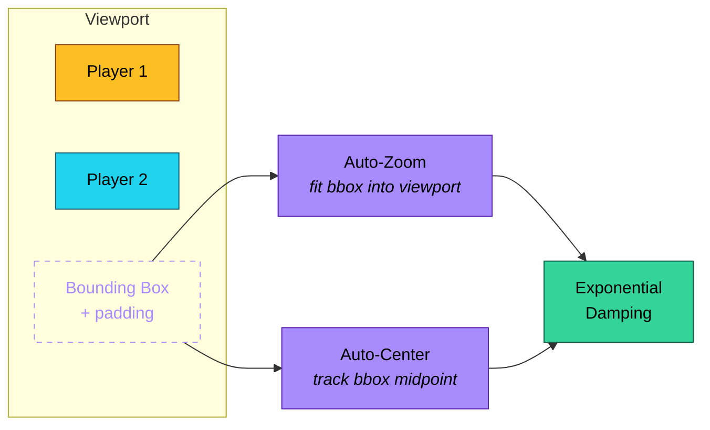
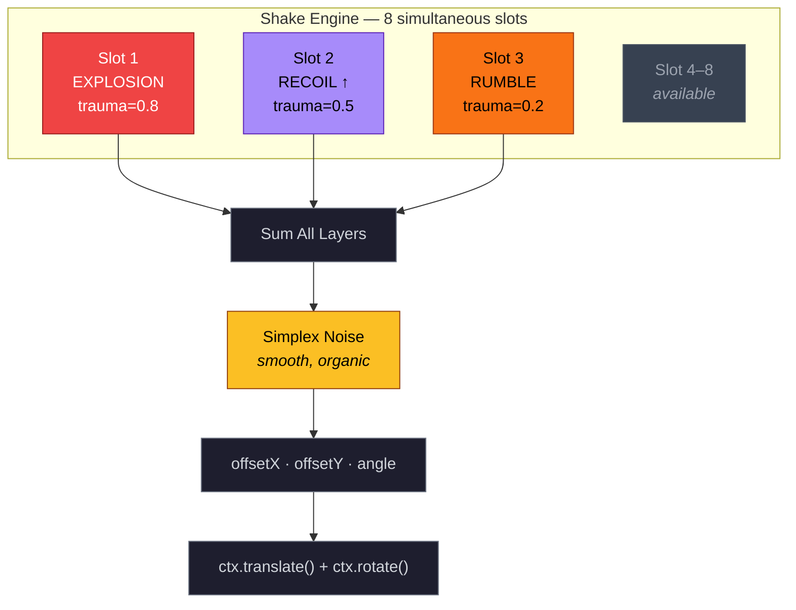
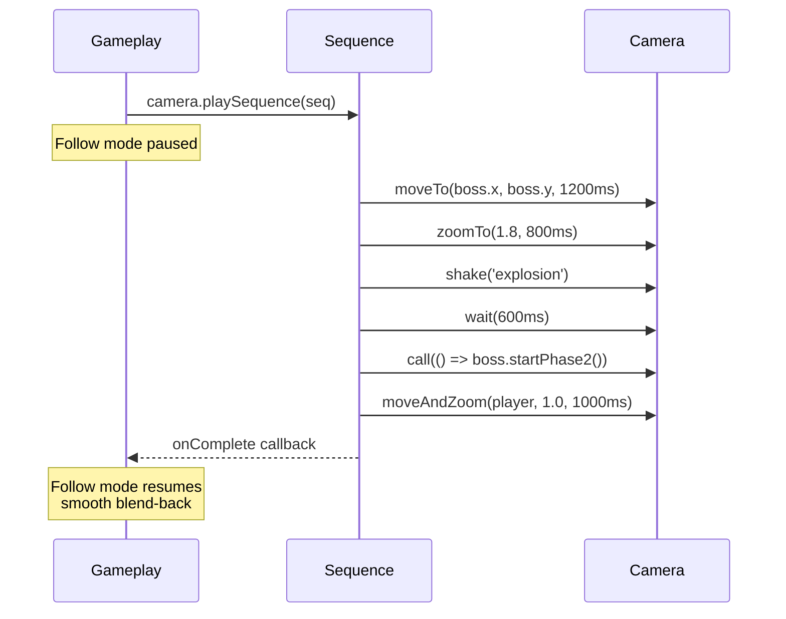
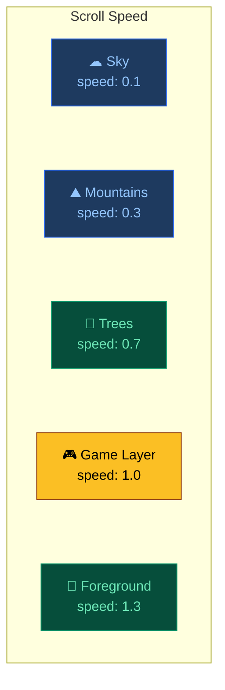
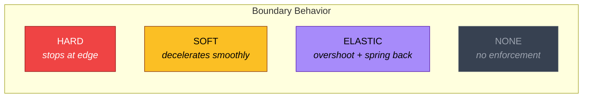
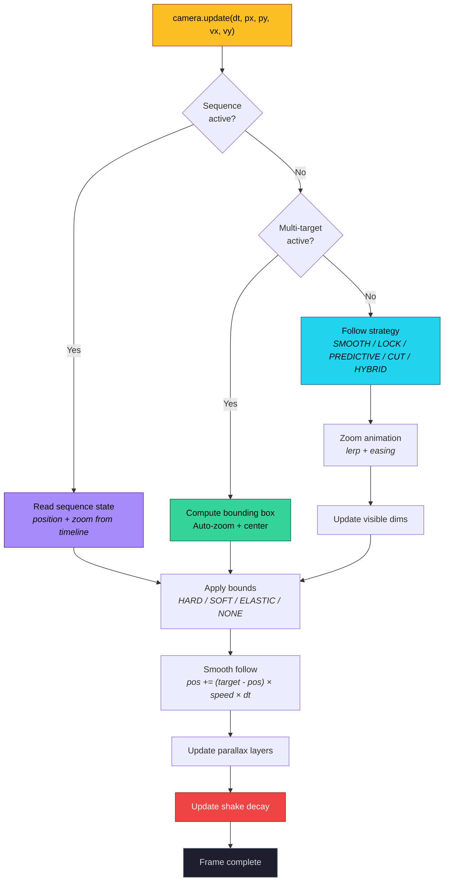

# @zakkster/lite-camera-pro

[](https://www.npmjs.com/package/@zakkster/lite-camera-pro)

[](https://github.com/sponsors/PeshoVurtoleta)
[](https://bundlephobia.com/result?p=@zakkster/lite-camera-pro)
[](https://www.npmjs.com/package/@zakkster/lite-camera-pro)
[](https://www.npmjs.com/package/@zakkster/lite-camera-pro)

[](https://opensource.org/licenses/MIT)

### Cinematic Camera System for Canvas2D Games

> Zero-GC. Zero external deps. Framework-agnostic.
> One import. Every camera feature a 2D game needs.

**2,916 lines of source · 10 modules · Full TypeScript · 105 unit tests**

```
npm install @zakkster/lite-camera-pro
```

Need only screen shake? Import the `./shake` subpath and pull just the engine +
presets (3.01 KB gz -- esm, unminified, gzip -9):

```js
import { createShakeState, addShake, updateShake, computeShake, getPreset } from '@zakkster/lite-camera-pro/shake';
```

---

## Why Pro?

You already ship games with `@zakkster/lite-camera`. It handles follow, deadzone, lookahead, and basic shake. That's enough to prototype.

**lite-camera-pro** is what you reach for when the prototype becomes a product:

- The boss reveal that zooms in, shakes, holds, then swoops back
- The co-op mode where the camera frames both players automatically
- The parallax layers that scroll at different depths
- The platformer camera that's smooth horizontally but pixel-locked vertically
- The explosion that layers three different shakes simultaneously

All of it runs at 60fps with **zero garbage collection** in the hot path.

---

## Architecture



Every module is a separate file. Tree-shaking drops what you don't use.

---

## Dependency Graph



All `@zakkster` packages. Zero third-party dependencies in the final bundle.

---

## lite-camera vs lite-camera-pro

| Feature | lite-camera | lite-camera-pro |
|:---|:---:|:---:|
| Smooth follow + deadzone + lookahead | ✓ | ✓ |
| Basic RNG shake | ✓ | — |
| Canvas transform apply | ✓ | ✓ |
| Debug rectangle | ✓ | ✓ |
| | | |
| **Zoom** (smooth, eased, anchor-point) | | ✓ |
| **Dynamic zoom-at-target** (tracks moving objects) | | ✓ |
| **5 follow modes** (smooth / lock / predictive / cut / hybrid) | | ✓ |
| **Multi-target auto-framing** (bounding box + auto-zoom) | | ✓ |
| **Noise-based shake** (simplex, 8 simultaneous layers) | | ✓ |
| **Directional shake** (recoil, landing, per-axis) | | ✓ |
| **8 shake presets** + custom registry | | ✓ |
| **Cinematic sequences** (timeline-driven camera moves) | | ✓ |
| **Fluent sequence builder** (moveTo · zoomTo · shake · wait · call) | | ✓ |
| **Sequence presets** (panTo · dramaticZoom · bossReveal) | | ✓ |
| **Parallax layer manager** (16 layers, per-layer speed) | | ✓ |
| **Smart bounds** (hard / soft / elastic / none — per-edge) | | ✓ |
| **Dynamic bounds** (room transitions, arenas) | | ✓ |
| **Pro debug HUD** (toggleable panels, trauma bars, sequence progress) | | ✓ |
| **Zero-alloc coordinate conversion** (screenToWorld / worldToScreen) | | ✓ |
| **Save / Load** (getState / setState) | | ✓ |
| **TypeScript declarations** | | ✓ |

---

## Quick Start

```js
import { CinematicCameraPro, FollowMode } from '@zakkster/lite-camera-pro';

const cam = new CinematicCameraPro(
    canvas.width,   // viewport width
    canvas.height,  // viewport height
    WORLD_W,        // world width
    WORLD_H         // world height
);

// ── Game loop ──
function update(dt) {
    cam.update(dt, player.x, player.y, player.vx, player.vy);
}

function render(ctx) {
    ctx.save();
    cam.apply(ctx);       // transforms the canvas
    drawWorld(ctx);
    cam.debug(ctx);       // world-space overlay
    ctx.restore();
    cam.debugHUD(ctx);    // screen-space HUD
}
```

---

## Feature Guide

### Follow Modes



Switch mid-gameplay. No position jumps (except CUT, which jumps by design).

```js
cam.setMode(FollowMode.SMOOTH);      // deadzone + lookahead + lerp
cam.setMode(FollowMode.LOCK);        // instant snap, no interpolation
cam.setMode(FollowMode.PREDICTIVE);  // velocity extrapolation
cam.setMode(FollowMode.CUT);         // hard cut (cutscene transitions)
cam.setMode(FollowMode.HYBRID);      // smooth horizontal, locked vertical

// Predictive tuning
cam.predictTime = 0.5; // seconds of velocity extrapolation

// Hybrid tuning
cam.hybridVerticalSnap = true;  // instant vertical (default)
cam.hybridVerticalSnap = false; // fast-lerp vertical
```

---

### Zoom System

```js
// Smooth zoom with easing
cam.setZoom(2.0, 0.5, easeOutExpo);    // zoom to 2× over 0.5s

// Zoom toward a static world point
cam.zoomAt(400, 300, 1.8, 0.8, easeOutExpo);

// Zoom toward a MOVING target — anchor follows the object each frame
cam.zoomAt(boss, 1.8, 0.8, easeOutExpo);

// Zoom limits
cam.minZoom = 0.25;
cam.maxZoom = 4.0;

// Read visible area (cached, zero-alloc — use for frustum culling)
const w = cam.visibleW;  // viewW / zoom
const h = cam.visibleH;  // viewH / zoom
```

**Coordinate conversion** (zero-alloc, caller-owned `out` pattern):
```js
const pt = { x: 0, y: 0 }; // allocate once at init
cam.screenToWorld(mouseX, mouseY, pt);
cam.worldToScreen(enemy.x, enemy.y, pt);
```

---

### Multi-Target Framing



```js
// Track two players — camera auto-zooms to keep both visible
cam.trackMultiple([player1, player2], {
    padding:    120,   // world-space padding around the bounding box
    minZoom:    0.4,
    maxZoom:    1.8,
    zoomSpeed:  4.0,   // zoom smoothing (higher = snappier)
    followSpeed: 5.0,  // position smoothing
});

// Add a third target dynamically
cam.trackMultiple([player1, player2, boss], { padding: 100 });

// Return to single-target follow (smooth transition)
cam.trackSingle();
```

---

### Shake System



Multiple shakes run simultaneously and sum together. Each slot has its own trauma, frequency, decay rate, and direction.

```js
// Backward-compatible simple trauma
cam.addTrauma(0.5);

// Named presets
cam.shakePreset('explosion');       // big boom
cam.shakePreset('earthquake');      // sustained rumble
cam.shakePreset('recoil');          // directional upward kick
cam.shakePreset('impact');          // sharp snappy jolt
cam.shakePreset('landing');         // vertical downward push
cam.shakePreset('damage');          // quick pulse, no rotation
cam.shakePreset('rumble');          // continuous low vibration
cam.shakePreset('heavy_impact');    // maximum everything

// Custom profile
cam.shake({
    trauma:    0.6,
    freq:      18,      // noise frequency (higher = jittery)
    decay:     1.5,     // trauma units lost per second
    maxOffset: 20,      // max pixel displacement
    maxAngle:  0.03,    // max rotation (radians)
    dirX:      1,       // directional X (0 = omnidirectional)
    dirY:      0,       // directional Y
});

// Layer multiple shakes for complex events
cam.shakePreset('explosion');
cam.shakePreset('recoil', 0.7);  // half intensity
cam.shakePreset('rumble');

// Register custom presets
import { registerPreset } from '@zakkster/lite-camera-pro';

registerPreset('sword_clash', {
    trauma: 0.3, freq: 28, decay: 3.0,
    maxOffset: 8, maxAngle: 0.03,
    dirX: 1, dirY: 0,
});

cam.shakePreset('sword_clash');

// Stop all shakes immediately
cam.clearShakes();
```

---

### Cinematic Sequences



**The killer feature.** Chain camera moves with a fluent API. The sequence takes full control of position and zoom. When it ends, follow mode resumes with a smooth transition.

```js
const seq = cam.createSequence({ onComplete: () => showUI() })
    .moveTo(boss.x, boss.y, 1200)                     // pan to boss
    .zoomTo(1.8, 800)                                  // zoom in
    .shake('explosion')                                 // screen shake
    .wait(600)                                          // hold for drama
    .call(() => boss.startPhase2())                     // trigger game event
    .moveAndZoom(player.x, player.y, 1.0, 1000);      // return to player

cam.playSequence(seq);

// Playback control
cam.stopSequence();      // cancel + smooth return to follow
seq.pause();             // freeze
seq.resume();            // continue
seq.seek(2000);          // jump to 2s mark
```

**Sequence presets** for common patterns:
```js
import { panTo, dramaticZoom, bossReveal, timedShake } from '@zakkster/lite-camera-pro';

// Simple pan
cam.playSequence(panTo(cam, 800, 400, 1500));

// Boss reveal: zoom in → shake → hold → return
cam.playSequence(bossReveal(cam, boss.x, boss.y, 3000));

// Dramatic zoom with overshoot easing
cam.playSequence(dramaticZoom(cam, boss.x, boss.y, 2.5, 1200));
```

---

### Parallax Layers



Up to 16 layers. Each scrolls at its own speed relative to the camera.

```js
cam.addParallaxLayer('sky',        0.1);   // barely moves
cam.addParallaxLayer('mountains',  0.3);   // slow
cam.addParallaxLayer('trees',      0.7);   // medium
// game layer is the normal camera (1.0)
cam.addParallaxLayer('foreground', 1.3);   // moves faster than camera

// Render each layer with its own transform
ctx.save();
cam.applyParallax('sky', ctx);
drawSky(ctx);
ctx.restore();

ctx.save();
cam.applyParallax('mountains', ctx);
drawMountains(ctx);
ctx.restore();

ctx.save();
cam.apply(ctx);     // normal game layer
drawWorld(ctx);
ctx.restore();

ctx.save();
cam.applyParallax('foreground', ctx);
drawForeground(ctx);
ctx.restore();

// Update or remove layers
cam.addParallaxLayer('sky', 0.15);   // update speed by re-adding same id
cam.removeParallaxLayer('foreground');
```

---

### Smart Bounds



Configure boundary behavior per-edge. Mix and match.

```js
import { BoundsType } from '@zakkster/lite-camera-pro';

// All edges the same
cam.setBoundsType(BoundsType.SOFT);

// Per-edge configuration
cam.setBoundsEdges({
    left:   BoundsType.HARD,
    right:  BoundsType.SOFT,
    top:    BoundsType.ELASTIC,
    bottom: BoundsType.HARD,
});

// Tuning
cam._bounds.softZone = 80;         // deceleration zone width (pixels)
cam._bounds.elasticMax = 30;       // max overshoot (pixels)
cam._bounds.elasticStrength = 8.0; // spring-back speed

// Dynamic bounds for rooms / arenas
cam.setBoundsRect(200, 200, 1200, 800);   // constrain to rectangle
cam.clearBoundsRect();                      // revert to full world
```

---

### Debug HUD

The Pro debug overlay shows everything at a glance. Each panel is individually toggleable.

```js
// Toggle panels on/off
cam.debugConfig.show.shake    = false;
cam.debugConfig.show.parallax = false;
cam.debugConfig.show.bounds   = true;

// Render
ctx.save();
cam.apply(ctx);
cam.debug(ctx);       // world-space: deadzone rect, lookahead vector, world bounds
ctx.restore();
cam.debugHUD(ctx);    // screen-space: position, zoom, mode, shake bars, sequence %
```

**Panels:** position · zoom · follow mode · shake slots (per-slot trauma bars) · sequence progress · parallax layers · bounds type

The debug HUD uses **zero allocations per frame** — it draws directly to canvas with no intermediate objects.

---

### Save & Load

```js
// Capture snapshot
const snapshot = cam.getState();
// → { posX, posY, targetX, targetY, zoom, mode }

// Restore
cam.setState(snapshot);
// Updates position, zoom, mode, and recalculates visible dimensions

// Serialize for save files
localStorage.setItem('camera', JSON.stringify(cam.getState()));
cam.setState(JSON.parse(localStorage.getItem('camera')));
```

---

## Update Loop Integration



One call to `update()` handles everything. The camera automatically dispatches to the right code path based on active state (sequence > multi-target > follow mode).

---

## Module Reference

| Module | Lines | Purpose |
|:---|---:|:---|
| `CinematicCameraPro.js` | 894 | Main class. Zoom, modes, multi-target, shake, sequences, parallax, bounds |
| `CameraSequence.js` | 513 | Fluent timeline builder + sequence presets |
| `DebugHUD.js` | 290 | Screen-space + world-space debug overlays |
| `ShakeEngine.js` | 286 | 8-slot noise-based shake pool |
| `BoundsSystem.js` | 220 | Per-edge boundary enforcement |
| `ParallaxManager.js` | 199 | 16-layer scroll manager |
| `FollowMode.js` | 179 | 5 pure follow strategies |
| `ShakePresets.js` | 177 | 8 frozen profiles + custom registry |
| `MultiTarget.js` | 125 | Bounding box framing + auto-zoom |
| `index.d.ts` | 228 | Full TypeScript declarations |
| `index.js` | 33 | Public exports (tree-shakeable) |
| **Total** | **3,144** | |

---

## Zero-GC Design

Every hot-path function in lite-camera-pro is allocation-free:

- **Coordinate conversion** uses caller-owned `out` objects (never returns `{ x, y }`)
- **Visible dimensions** are cached as `cam.visibleW` / `cam.visibleH` (no `getVisibleArea()`)
- **Shake slots** are pre-allocated in a fixed-size pool (8 slots, reused via steal)
- **Follow modes** are pure functions that mutate `cam.target[]` directly
- **Debug HUD** draws directly to canvas — no intermediate line objects
- **Parallax layers** are pre-allocated (16 slots, mutated in place)
- **Bounds state** is a single pre-allocated config object

The only allocations happen during **setup** (constructor, `createSequence()`, `trackMultiple()`) — never inside the 60fps update/render loop.

---

## TypeScript

Full declarations ship in `src/index.d.ts`:

```ts
import {
    CinematicCameraPro,
    FollowMode,
    BoundsType,
    WrapMode,
    createCameraSequence,
    EXPLOSION,
    registerPreset,
} from '@zakkster/lite-camera-pro';

const cam = new CinematicCameraPro(800, 600, 3200, 2400);
cam.setMode(FollowMode.PREDICTIVE);
cam.setBoundsType(BoundsType.ELASTIC);

const seq: CameraSequence = cam.createSequence()
    .moveTo(400, 300, 1200)
    .zoomTo(2.0, 800)
    .shake('explosion');
```

---

## Testing

```bash
npm test          # vitest run — 105 tests across 2 files
npm run test:watch  # vitest watch mode
```

`CinematicCameraPro.test.js` covers the facade: initialization, coordinate conversion, all 5 follow modes, multi-target framing (including overlapping-target edge cases), zoom animation, shake engine (slot stealing, directional normalization, decay), bounds enforcement, parallax management, sequences, save/load, and destruction. `subsystems.test.js` covers the directly-exported API: the DebugHUD draws (mock-context smoke tests), the functional shake / parallax / bounds helpers, the multi-target updater, the shake-preset registry, and the sequence preset helpers (panTo, dramaticZoom, bossReveal, timedShake).

---

## Migration from lite-camera

lite-camera-pro extends `CinematicCamera`. Drop-in replacement:

```diff
- import { CinematicCamera } from '@zakkster/lite-camera';
+ import { CinematicCameraPro as CinematicCamera } from '@zakkster/lite-camera-pro';

  const cam = new CinematicCamera(800, 600, 3200, 2400);
  // Everything from lite-camera still works.
  // addTrauma(), update(), apply(), debug() — all backward-compatible.
```

Then add Pro features incrementally. Nothing breaks.

---

## License

MIT © Zahary Shinikchiev. See [LICENSE](LICENSE).
